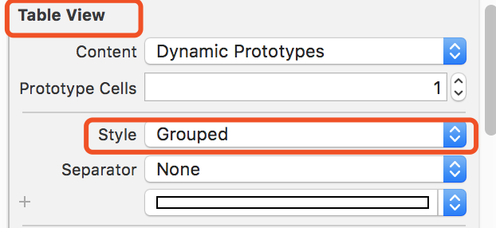

   隐藏多余的cell分割线
```swift
tableView.tableFooterView = UIView() //隐藏多余的cell的分割线
tableView.tableHeaderView = headerView //设置tableView头部
tableView.theme_backgroundColor = "colors.tableViewBackgroundColor" //背景色
tableView.separatorStyle = .none  //隐藏所有分割线
```


TableView常用代理
```swift
override func viewDidLoad() {
    super.viewDidLoad()
	//创建一个重用的单元格
	self.tableView!.register(UINib(nibName:"MyTableViewCell", bundle:nil),forCellReuseIdentifier:"myCell")
}
```
```swift
  //每一组的头部
    override func tableView(_ tableView: UITableView, viewForHeaderInSection section: Int) -> UIView? {
        if(section == 0){
            print("自定义头部")
            let headerView = Bundle.main.loadNibNamed("NewsGoodsView",owner: self, options: nil)?[0] as! UIView
        //没有实现类的Xib内部组件需要通过tag来获取
//            let titleLabel = headerView.viewWithTag(1) as! UILabel
//            titleLabel.text = self.adHeaders?[section]
            return headerView
        }
        return UIView()
    }
   
    //显示多少组
    override func numberOfSections(in tableView: UITableView) -> Int {
        return 1
    }
    //每一组头部的高度
    override func tableView(_ tableView: UITableView, heightForHeaderInSection section: Int) -> CGFloat {
        return 40
    }
    //每一组显示多少条数据
    override func tableView(_ tableView: UITableView, numberOfRowsInSection section: Int) -> Int {
        return 2;
    }
    //每一个Cell的高度
    override func tableView(_ tableView: UITableView, heightForRowAt indexPath: IndexPath) -> CGFloat {
        return 400
    }
    
    //填充每一个Cell的内容
    override func tableView(_ tableView: UITableView, cellForRowAt indexPath: IndexPath) -> UITableViewCell {
       let cell = tableView.dequeueReusableCell(withIdentifier: "myCell") as! MyTableViewCell //取出复用(注册过的)cell
       return cell
       //return UITableViewCell()
    }
    //回调事件
    override func tableView(_ tableView: UITableView, didSelectRowAt indexPath: IndexPath) {
//        tableView.cellForRow(at: indexPath)?.selectionStyle = .none  cell为空白样式
        print("当前点击了\(indexPath.row)")
    }

  
    func tableView(_ tableView: UITableView, willDisplayFooterView view: UIView, forSection section: Int) {
         print("加载新数据")
    } 
    func scrollViewDidEndDecelerating(_ scrollView: UIScrollView) {
        print("停止滚动")
    }
```

数据源代理
```swift
self.tableView.delegate = self
self.tableView.dataSource = self
```
**等价于**


tableViewCell中想拿到父tableView控件:使用拓展
1，扩展UITableViewCell

为方便使用，这里对 UITableViewCell进行扩展，添加个方法用来获取其所在的 tableView

```swift
//返回cell所在的UITableView
func superTableView() -> UITableView? {
    for view in sequence(first: self.superview, next: { $0?.superview }) {
        if let tableView = view as? UITableView {
            return tableView
        }
    }
    return nil
}
```
2.使用demo
```swift
//按钮点击事件响应
func tapped(_ button:UIButton){
    let tableView = superTableView()
    let indexPath = tableView?.indexPath(for: self)
    print("indexPath：\(indexPath!)")
}
```


cell中获取当前的index
```swift
let tableView = superTableView()
let indexPath = tableView?.indexPath(for: self)
```
TableView滑动到底部
```swift
override func scrollViewDidScroll(_ scrollView: UIScrollView) {
        let  height = scrollView.frame.size.height
        let contentYoffset = scrollView.contentOffset.y
        let distanceFromBottom = scrollView.contentSize.height - contentYoffset
        if distanceFromBottom < height {
            print(" you reached end of the table")
        }
    }
```
底部和顶部 
1.viewForHeaderInSection 随滚动条一起滚动,粘住
2.viewForFooterInSection 随滚动条一起滚动

